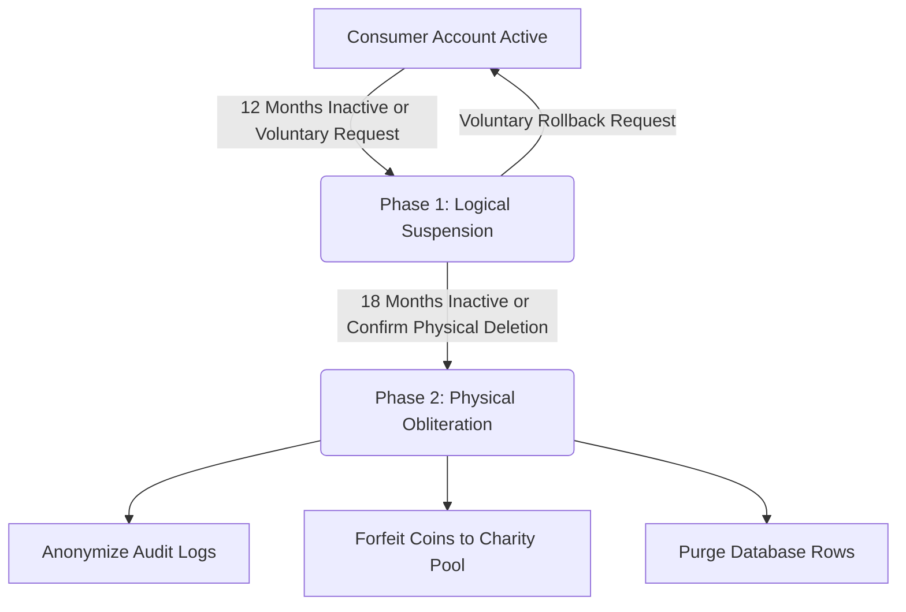

# REMOTE-OX API — Unified & Production-Ready Software Specification Document

## Clarifications Applied
- MCP authenticates via Google OAuth; MCP server (separate project) forwards Google access token to `POST /api/v1/auth/mcp`
- Stored Google access tokens are **not** persisted in the database for security; validated dynamically, and sessions are governed by state-free JWTs
- Input validation uses `validator` crate
- Inactivity timers trigger on no API activity (12/18 months); `consumers.last_login_at` is updated only during `/auth/mcp` authentication to prevent database contention
- Export endpoint returns only candidate data, resume, and cover letter
- Message costing: 1 coin per KB, ceiling rounding, no hard size limit
- Stripe Checkout is the only payment flow; `POST /api/v1/jobs` with insufficient balance creates a pending job and returns a Stripe Checkout URL; webhook auto-completes the job
- Recruiters must be associated with a company (company_id required)
- Candidates can create companies directly (solving the recruiter-first circular bootstrap issue)

## Project Identity

- **Project Name:** REMOTE-OX API
- **Project Type:** Headless Job Relay / Job Board API
- **Primary Goal:** Ultra-low-cost, secure, scalable backend API for job marketplace operations with AI/MCP integration support.
- **No frontend/UI included.**

The system is designed to:
- Operate with extremely low infrastructure cost
- Use minimal dependencies
- Consume minimal RAM/CPU
- Run entirely on a small, single-node Virtual Private Server (VPS)
- Support AI agents via Model Context Protocol (MCP)
- Be secure by default and deny-by-default
- Be LGPD (Lei Geral de Proteção de Dados) and GDPR compliant
- Be fully automatable by AI code-generation agents

---

# 1. Executive Summary

REMOTE-OX is a fully headless API platform for job listings, candidate profiles, applications, recruiter management, company verification, messaging, wallet/payments, and AI-assisted operations.

The platform exposes:
- **REST API:** Versioned JSON-only endpoints (implemented in this project)
- **MCP Server Interface:** Contract consumed by the external MCP server project

All consumers interact through the separate MCP server project, CLI tools, or custom frontends.

---

# 2. Tech Stack Decisions & Non-Functional Requirements

## 2.1 Language & Runtime
- **Language:** Rust (Stable Edition)
- **Runtime:** Tokio
  - *Production Config:* `#[tokio::main(flavor = "multi_thread", worker_threads = 2)]` (or configured as a single thread for ultra-low memory footprints).

## 2.2 API & Web Framework
- **Framework:** Axum
- **Middleware:** Tower-HTTP (for compression, request logging, tracing propagation, and CORS handling)
- **Documentation:** `utoipa` (for compile-time checked OpenAPI spec generation)
- **Validation:** `validator` crate (for declarative field validation)
- **Error Handling:** `thiserror` for typed domain errors, mapping directly to HTTP status codes via custom implementation of `IntoResponse`; `anyhow` for underlying application/infrastructure errors.

## 2.3 Database Layer
- **Engine:** SQLite (operated in Write-Ahead Log (WAL) mode)
- **Access Layer:** SQLx (for compile-time checked, parameterized queries)
- **Migrations:** SQLx migrations embedded and executed at startup
- **Strict Guidelines:** No ORM or ActiveRecord patterns. No runtime query builders. Single-writer connection pool architecture (max pool size of 4, with 1 dedicated writer).

## 2.4 Task & Event Queue
- **Engine:** SQLite-backed persistence queue (no external Redis, RabbitMQ, or Kafka brokers).
- **In-Memory Channel:** `tokio::sync::mpsc` for immediate in-process task dispatching, backed by database tables for crash durability and retries.

## 2.5 Caching & Rate Limiting Strategy
- **HTTP Cache:** `Cache-Control` + `ETag` headers for conditional requests
- **In-Memory Memoization & Rate Limiting:** `moka` cache crate (TTL-based with size eviction).
  - Categorization and static verification lookups are stored in memoized caches.
  - **Rate Limiting** is performed entirely in-memory via `moka` (sliding-window token bucket key-value store) to avoid SQLite write lock contention under load. Rate limits reset on binary restart, which is acceptable.

---

# 3. Domain Model & Role Definitions

The platform enforces a strict role-based access control (RBAC) model:

| Role | Description |
| :--- | :--- |
| **Candidate** | Job seekers who publish resumes, search jobs, apply, and communicate with recruiters. Default role on first connection. Can create companies to bootstrap a recruiter career. |
| **Recruiter** | Corporate actors who post jobs, review applications, and contact candidates. Must be associated with a company. Upgraded from candidate automatically on first Stripe topup of $1 or more. |
| **Company Admin** | Recruiter with administrative rights over their company profile (can edit company, add/remove other recruiters, buy verification, or buy donations). The consumer who creates the company becomes its first admin. |
| **Admin** | Platform operators with access to moderation, audit logs, API key management, and global task controls. |
| **DPO (Data Protection Officer)** | Compliance officer role with access to GDPR/LGPD data request logs, breach incidents, and consent audit trails. |

---

# 4. SQLite Entity-Relationship Database Schema

To minimize resource footprint and guarantee single-node VPS performance, the schema is optimized with specific column types and comprehensive index structures. Timestamps are formatted as ISO8601 strings in UTC timezone (`YYYY-MM-DDTHH:MM:SSZ`). Redundant junction tables have been removed to align with standard one-to-many associations.

```sql
-- SQLite Pragmas configured at runtime connection startup:
-- PRAGMA journal_mode=WAL;
-- PRAGMA synchronous=NORMAL;
-- PRAGMA foreign_keys=ON;
-- PRAGMA temp_store=MEMORY;
-- PRAGMA mmap_size=268435456;

-- 1. COMPANIES
CREATE TABLE companies (
    id TEXT PRIMARY KEY NOT NULL, -- UUID
    legal_name TEXT NOT NULL,
    trade_name TEXT NOT NULL,
    description TEXT,
    logo_cdn_url TEXT,
    website_domain TEXT NOT NULL UNIQUE,
    email_domain TEXT NOT NULL UNIQUE, -- Must not belong to a generic/public provider blocklist
    national_registration_number TEXT,
    is_verified INTEGER DEFAULT 0 CHECK(is_verified IN (0, 1)),
    is_blocked INTEGER DEFAULT 0 CHECK(is_blocked IN (0, 1)),
    donation_tier INTEGER DEFAULT 0 CHECK(donation_tier IN (0, 1, 2)), -- 0=None, 1=Donor ($100+), 2=Patron ($1000+)
    verified_until TEXT, -- ISO8601 UTC Date
    verification_message_allowance_total INTEGER DEFAULT 0, -- Set to 1000 when verified
    verification_message_allowance_used INTEGER DEFAULT 0,
    created_at TEXT NOT NULL DEFAULT (strftime('%Y-%m-%dT%H:%M:%SZ', 'now'))
);

-- 2. CONSUMERS (Unified user records)
CREATE TABLE consumers (
    id TEXT PRIMARY KEY NOT NULL, -- UUID
    role TEXT NOT NULL CHECK(role IN ('candidate', 'recruiter', 'company_admin', 'admin', 'dpo')),
    name TEXT NOT NULL,
    email TEXT NOT NULL UNIQUE,
    phone TEXT,
    country_residence TEXT,
    city_residence TEXT,
    company_id TEXT, -- Nullable. Recruiters and Company Admins belong to exactly one company.
    job_title_function TEXT, -- Recruiter only
    consent_accepted INTEGER DEFAULT 0 CHECK(consent_accepted IN (0, 1)),
    consent_policy_version TEXT, -- Tracks the exact version of the Privacy Policy accepted by the user
    is_suspended INTEGER DEFAULT 0 CHECK(is_suspended IN (0, 1)),
    is_blocked INTEGER DEFAULT 0 CHECK(is_blocked IN (0, 1)),
    suspended_at TEXT, -- ISO8601 UTC timestamp
    last_login_at TEXT NOT NULL DEFAULT (strftime('%Y-%m-%dT%H:%M:%SZ', 'now')), -- Updated only at login to prevent lock overhead
    created_at TEXT NOT NULL DEFAULT (strftime('%Y-%m-%dT%H:%M:%SZ', 'now')),
    FOREIGN KEY (company_id) REFERENCES companies(id) ON DELETE SET NULL
);

-- 3. RESUMES (Acts as Candidate Profiles)
CREATE TABLE resumes (
    id TEXT PRIMARY KEY NOT NULL, -- UUID
    candidate_id TEXT NOT NULL UNIQUE,
    work_area TEXT NOT NULL CHECK(work_area IN ('Developer', 'DevOps', 'Manager', 'Tester')),
    cover_letter TEXT,
    resume_markdown TEXT NOT NULL,
    hashtags TEXT NOT NULL, -- Comma-separated search tags (e.g., "rust,backend,linux")
    updated_at TEXT NOT NULL DEFAULT (strftime('%Y-%m-%dT%H:%M:%SZ', 'now')),
    FOREIGN KEY (candidate_id) REFERENCES consumers(id) ON DELETE CASCADE
);

-- 4. JOBS
CREATE TABLE jobs (
    id TEXT PRIMARY KEY NOT NULL, -- UUID
    recruiter_id TEXT NOT NULL,
    company_id TEXT NOT NULL,
    title TEXT NOT NULL,
    description_markdown TEXT NOT NULL,
    work_area TEXT NOT NULL CHECK(work_area IN ('Developer', 'DevOps', 'Manager', 'Tester')),
    region_filter TEXT, -- e.g., 'Europe', 'Latin America', 'Asia'
    location_type TEXT NOT NULL CHECK(location_type IN ('remote', 'onsite', 'hybrid')),
    contract_type TEXT NOT NULL CHECK(contract_type IN ('contract', 'freelance')),
    schedule_type TEXT NOT NULL CHECK(schedule_type IN ('full-time', 'part-time')),
    is_entry_level INTEGER DEFAULT 0 CHECK(is_entry_level IN (0, 1)),
    is_pwd_friendly INTEGER DEFAULT 0 CHECK(is_pwd_friendly IN (0, 1)),
    required_residence TEXT, -- Specific country constraint (e.g., 'Brazil') or NULL
    is_verified INTEGER DEFAULT 0 CHECK(is_verified IN (0, 1)), -- Matches company status at post time
    is_blocked INTEGER DEFAULT 0 CHECK(is_blocked IN (0, 1)),
    hashtags TEXT, -- Comma-separated search tags (e.g., "rust,tokio,axum")
    salary_range TEXT, -- Optional free text (e.g., "$120k-$150k")
    message_allowance_total INTEGER DEFAULT 0, -- Free messages allowance included in job purchase (100 per job)
    message_allowance_used INTEGER DEFAULT 0,
    status TEXT NOT NULL DEFAULT 'active' CHECK(status IN ('pending_payment', 'active', 'expired', 'closed')),
    expires_at TEXT NOT NULL, -- ISO8601 UTC date
    created_at TEXT NOT NULL DEFAULT (strftime('%Y-%m-%dT%H:%M:%SZ', 'now')),
    FOREIGN KEY (recruiter_id) REFERENCES consumers(id) ON DELETE RESTRICT,
    FOREIGN KEY (company_id) REFERENCES companies(id) ON DELETE RESTRICT
);

-- 5. APPLICATIONS
CREATE TABLE applications (
    id TEXT PRIMARY KEY NOT NULL, -- UUID
    job_id TEXT NOT NULL,
    candidate_id TEXT NOT NULL,
    status TEXT NOT NULL DEFAULT 'pending' CHECK(status IN ('pending', 'reviewed', 'shortlisted', 'rejected', 'hired')),
    phone_snapshot TEXT, -- Contact snapshot captured at submit time
    profile_snapshot TEXT NOT NULL, -- Resume Markdown snapshot captured at submit time
    is_suspended INTEGER DEFAULT 0 CHECK(is_suspended IN (0, 1)), -- Logically suspended if candidate is suspended
    created_at TEXT NOT NULL DEFAULT (strftime('%Y-%m-%dT%H:%M:%SZ', 'now')),
    FOREIGN KEY (job_id) REFERENCES jobs(id) ON DELETE CASCADE,
    FOREIGN KEY (candidate_id) REFERENCES consumers(id) ON DELETE CASCADE
);

-- 6. MESSAGES
CREATE TABLE messages (
    id TEXT PRIMARY KEY NOT NULL, -- UUID
    sender_id TEXT NOT NULL,
    receiver_id TEXT NOT NULL,
    job_id TEXT, -- Nullable (Optional associate context)
    content TEXT NOT NULL, -- Stored message payload
    content_kb REAL NOT NULL, -- Calculated size in kilobytes at send time (for coin deduction)
    expires_at TEXT NOT NULL, -- ISO8601 UTC date (100 days default TTL)
    is_suspended INTEGER DEFAULT 0 CHECK(is_suspended IN (0, 1)),
    created_at TEXT NOT NULL DEFAULT (strftime('%Y-%m-%dT%H:%M:%SZ', 'now')),
    FOREIGN KEY (sender_id) REFERENCES consumers(id) ON DELETE RESTRICT,
    FOREIGN KEY (receiver_id) REFERENCES consumers(id) ON DELETE RESTRICT,
    FOREIGN KEY (job_id) REFERENCES jobs(id) ON DELETE SET NULL
);

-- 7. WALLETS (Immutable accounting link)
CREATE TABLE wallets (
    consumer_id TEXT PRIMARY KEY NOT NULL,
    balance_coins INTEGER NOT NULL DEFAULT 0 CHECK(balance_coins >= 0),
    updated_at TEXT NOT NULL DEFAULT (strftime('%Y-%m-%dT%H:%M:%SZ', 'now')),
    FOREIGN KEY (consumer_id) REFERENCES consumers(id) ON DELETE CASCADE
);

-- 8. TRANSACTIONS (Append-only immutable financial ledger)
CREATE TABLE transactions (
    id TEXT PRIMARY KEY NOT NULL, -- UUID
    wallet_id TEXT NOT NULL,
    coins_change INTEGER NOT NULL, -- positive for credits, negative for debits
    type TEXT NOT NULL CHECK(type IN ('topup', 'job_post', 'message', 'verification', 'donation', 'refund')),
    description TEXT,
    reference_id TEXT, -- UUID reference to related jobs, messages, or verifications
    created_at TEXT NOT NULL DEFAULT (strftime('%Y-%m-%dT%H:%M:%SZ', 'now')),
    FOREIGN KEY (wallet_id) REFERENCES wallets(consumer_id) ON DELETE RESTRICT
);

-- 9. CONSENTS (Immutable audit trail for legal compliance)
CREATE TABLE consents (
    id TEXT PRIMARY KEY NOT NULL, -- UUID
    consumer_id TEXT NOT NULL,
    policy_version TEXT NOT NULL,
    action TEXT NOT NULL CHECK(action IN ('granted', 'revoked')),
    ip_address TEXT,
    user_agent TEXT,
    created_at TEXT NOT NULL DEFAULT (strftime('%Y-%m-%dT%H:%M:%SZ', 'now')),
    FOREIGN KEY (consumer_id) REFERENCES consumers(id) ON DELETE CASCADE
);

-- 10. AUDIT LOGS (Immutable security and platform events)
CREATE TABLE audit_logs (
    id TEXT PRIMARY KEY NOT NULL, -- UUID
    actor_id TEXT, -- Kept or hashed (if consumer permanently deleted)
    actor_type TEXT NOT NULL CHECK(actor_type IN ('candidate', 'recruiter', 'company_admin', 'admin', 'system')),
    action TEXT NOT NULL, -- e.g., 'auth.login', 'profile.delete'
    resource_type TEXT NOT NULL, -- e.g., 'resume', 'job', 'wallet'
    resource_id TEXT,
    metadata TEXT, -- JSON payload string
    created_at TEXT NOT NULL DEFAULT (strftime('%Y-%m-%dT%H:%M:%SZ', 'now'))
);

-- 11. API KEYS
CREATE TABLE api_keys (
    id TEXT PRIMARY KEY NOT NULL, -- UUID
    key_hash TEXT NOT NULL UNIQUE, -- SHA-256 hash of API key
    consumer_id TEXT NOT NULL,
    scope TEXT NOT NULL CHECK(scope IN ('candidate_api', 'recruiter_api', 'admin_api')),
    description TEXT,
    is_active INTEGER DEFAULT 1 CHECK(is_active IN (0, 1)),
    expires_at TEXT NOT NULL, -- ISO8601 UTC date
    created_at TEXT NOT NULL DEFAULT (strftime('%Y-%m-%dT%H:%M:%SZ', 'now')),
    FOREIGN KEY (consumer_id) REFERENCES consumers(id) ON DELETE CASCADE
);

-- 12. PENDING TASKS (Durable task queue scheduler)
CREATE TABLE pending_tasks (
    id TEXT PRIMARY KEY NOT NULL, -- UUID
    task_type TEXT NOT NULL CHECK(task_type IN ('delete_expired_jobs', 'delete_expired_messages', 'delete_expired_applications', 'suspend_inactive_accounts', 'purge_suspended_accounts', 'rotate_audit_archives', 'close_expired_jobs')),
    payload TEXT, -- JSON arguments representation
    run_at TEXT NOT NULL, -- ISO8601 UTC timestamp (execution time constraint)
    attempts INTEGER DEFAULT 0 CHECK(attempts >= 0),
    max_attempts INTEGER DEFAULT 5 CHECK(max_attempts > 0),
    created_at TEXT NOT NULL DEFAULT (strftime('%Y-%m-%dT%H:%M:%SZ', 'now'))
);

-- 13. FAILED TASKS (Dead-Letter Queue for manual intervention)
CREATE TABLE failed_tasks (
    id TEXT PRIMARY KEY NOT NULL, -- UUID
    task_type TEXT NOT NULL,
    payload TEXT,
    attempts INTEGER NOT NULL,
    last_error TEXT,
    failed_at TEXT NOT NULL DEFAULT (strftime('%Y-%m-%dT%H:%M:%SZ', 'now'))
);

-- 14. BREACH INCIDENTS (Audit log of security breach detections for data minimization compliance)
CREATE TABLE breach_incidents (
    id TEXT PRIMARY KEY NOT NULL, -- UUID
    description TEXT NOT NULL,
    detected_at TEXT NOT NULL, -- ISO8601 UTC timestamp
    reported_at TEXT, -- ISO8601 UTC timestamp
    remediation_summary TEXT,
    created_at TEXT NOT NULL DEFAULT (strftime('%Y-%m-%dT%H:%M:%SZ', 'now'))
);

-- 15. DATA REQUESTS (GDPR/LGPD DSAR request tracker)
CREATE TABLE data_requests (
    id TEXT PRIMARY KEY NOT NULL, -- UUID
    consumer_id TEXT NOT NULL,
    request_type TEXT NOT NULL CHECK(request_type IN ('export', 'delete')),
    status TEXT NOT NULL CHECK(status IN ('pending', 'processing', 'completed', 'failed')),
    completed_at TEXT, -- ISO8601 UTC timestamp
    created_at TEXT NOT NULL DEFAULT (strftime('%Y-%m-%dT%H:%M:%SZ', 'now')),
    FOREIGN KEY (consumer_id) REFERENCES consumers(id) ON DELETE CASCADE
);

-- INDEX STRUCTURES FOR OPTIMAL LATENCY & MEMORY USAGE
CREATE INDEX idx_consumers_auth ON consumers (email);
CREATE INDEX idx_consumers_company ON consumers (company_id);
CREATE INDEX idx_consumers_cleanup ON consumers (last_login_at, is_suspended);
CREATE INDEX idx_resumes_work_area ON resumes (work_area);
CREATE INDEX idx_jobs_search ON jobs (status, work_area, region_filter, location_type, expires_at);
CREATE INDEX idx_jobs_ranking ON jobs (is_verified, expires_at DESC);
CREATE INDEX idx_applications_composite ON applications (job_id, candidate_id);
CREATE INDEX idx_applications_candidate ON applications (candidate_id, created_at DESC);
CREATE INDEX idx_messages_inbox ON messages (receiver_id, expires_at);
CREATE INDEX idx_messages_sent ON messages (sender_id, created_at DESC);
CREATE INDEX idx_transactions_wallet ON transactions (wallet_id, created_at DESC);
CREATE INDEX idx_api_keys_hash ON api_keys (key_hash, is_active);
CREATE INDEX idx_pending_tasks_scheduler ON pending_tasks (run_at, attempts);
```

---

# 5. Core Re-Architected Modules & Business Logic

## 5.1 Authentication & Session Management

Authentication is handled via Google OAuth. The MCP server (separate project) handles the OAuth dance with Google and forwards the Google access token to this API server.

- **`POST /api/v1/auth/mcp`:** Receives Google access token, verifies it with Google's tokeninfo or userinfo endpoint, extracts consumer identity (email, name), upserts the consumer record, and returns a signed JWT access token.
- **Security Protocols:** Storing raw Google OAuth tokens in SQLite is strictly forbidden. The token is validated dynamically on request and thrown away immediately.
- **Access Tokens:** Signed with HMAC-SHA512 (`HS512`). Expiration set to 15 minutes. Must contain `sub` (consumer UUID) and `role`. No session tracking — JWT is fully stateless.
- **Token Refresh:** The MCP server handles token re-issuance by calling `/auth/mcp` with a fresh Google access token when needed. No refresh tokens stored in this API.
- **API Keys:** Cryptographic random keys hashed with SHA-256 for secure storage. Scoped permissions (`candidate_api`, `recruiter_api`, `admin_api`) govern API operations. Passed via the standard `X-API-Key` HTTP header.

**First connection flow:**
1. MCP server sends Google access token to `POST /api/v1/auth/mcp`
2. API verifies token with Google, extracts `email` and identity details
3. If consumer does not exist, creates record with role `candidate`
4. Returns JWT access token + role + consent status
5. **Activity updates:** `consumers.last_login_at` is updated only during this `/auth/mcp` endpoint validation. General API requests do not trigger timestamp updates to avoid heavy database write loads.

**Bootstrapping Recruiter Upgrades:** 
To prevent role-prerequisite deadlocks, any candidate is permitted to call `POST /api/v1/companies` to define a corporate entity. The candidate becomes the `company_admin` of that company. Upon their first topup ≥ $1 (100 coins) via Stripe, the candidate is globally upgraded to `company_admin` or `recruiter`, unblocking job postings.

## 5.2 Consent & GDPR/LGPD Compliance Framework

To satisfy LGPD and GDPR frameworks under a zero-cookie regime, the platform implements strict data lifecycle routines:
- **First-Login Consent Interceptor:** Following authentication, any consumer whose `consumers.consent_policy_version` does not match the system's current `POLICY_VERSION` environment variable is restricted. All endpoints (except `POST /consent/accept` and `GET /consent/status`) immediately fail with a `403 Forbidden` response.
- **Refusal Action:** If a consumer explicitly rejects the policy, the system triggers immediate physical deletion of their registration payloads and terminates the session.
- **Dual-Phase Account Deletion Flow:**
  - **Phase 1: Logical Suspension:** Triggered via `DELETE /me/suspend`.
    - Hides the profile from search results.
    - Sets `is_suspended = 1` in `consumers` and `is_suspended = 1` in all associated `applications`.
    - Freezes the wallet balance.
    - Revokes active API keys.
  - **Phase 2: Physical Obliteration:** Triggered via `DELETE /me`.
    - Only available if Phase 1 was initiated.
    - Purges all rows across `consumers`, `resumes`, `messages`, `applications`, and `consents` for the target UUID.
    - Zeroes the wallet balance. Any remaining coins are routed to the designated instance charity pool (tracked in `transactions` with type `donation`).
    - Anonymizes `actor_id` in `audit_logs` by replacing it with a SHA-256 hash of the ID concatenated with a system salt.
- **Automated Data Minimization Jobs (TTLs):**
  - Jobs, Applications, and Internal Messages auto-purge after **100 days**.
  - Expired jobs (past `expires_at`) have their status set to `expired` by a background worker (`close_expired_jobs` task).
  - Candidate Inactivity: At 12 months of inactivity (measured by `last_login_at`), auto-trigger Phase 1 (Logical Suspension). At 18 months of inactivity, trigger Phase 2 (Physical Obliteration) and forfeit wallet balances.
  - Company Inactivity: If all recruiters belonging to a company are inactive for 12 months, the company profile is hidden. At 18 months, physical deletion clears the company database records.



## 5.3 Regulated Messaging & Quota Allocation Engine

To ensure spam mitigation and low infrastructure costs, messaging size and delivery are tightly restricted:

- **Message Cost Rules:**
  - 1 coin per KB of content, ceiling rounding (1.3 KB → 2 coins).
  - No hard size limit (cost scales linearly).
  - Cost is calculated at send time from the actual content size (`LENGTH(content)`).

- **Free Quotas vs. Paid Coins Logic:**
  Message delivery queries execute the following decision matrix to determine cost:
  1. **Job Application Context Check:** If the message is part of an active application thread (referencing a `job_id`):
     - The database checks if the associated job listing has message quota remaining: `jobs.message_allowance_used` < `jobs.message_allowance_total`.
     - If true: The message cost is set to **0 coins**, and `jobs.message_allowance_used` is incremented by 1.
  2. **Corporate Allowance Check:** If the job quota is exhausted or the message is outside a job context (e.g., direct outreach):
     - The database checks the sender company's verification allowance: `companies.verification_message_allowance_used` < `companies.verification_message_allowance_total`.
     - If true: The message cost is set to **0 coins**, and `companies.verification_message_allowance_used` is incremented by 1.
  3. **Direct Wallet Transaction:** If all free/allowance pools are exhausted:
     - The system calculates message payload size, deducts the corresponding cost from the sender's wallet, and appends a record to the `transactions` ledger.
     - If the wallet balance is insufficient, the system returns a `402 Payment Required` error.

## 5.4 Database Task Queue Architecture

The platform operates background workers driven by SQLite tables (`pending_tasks` and `failed_tasks`) to process asynchronous workflows without external brokers:
- **Worker Loop:** A dedicated Tokio background task polls `pending_tasks` where `run_at <= CURRENT_TIMESTAMP` and `attempts < max_attempts`.
- **Concurrency Control:** Utilizes SQLite's `IMMEDIATE` transaction mode or `UPDATE ... RETURNING` to lock a task, preventing multiple worker threads from executing the same task.
- **Error Handlers:** If a task fails, the `attempts` counter increments and a backoff delay is updated in `run_at`. Once `attempts` matches `max_attempts`, the task is removed from `pending_tasks` and logged to the dead-letter queue table `failed_tasks` for administrative intervention.

## 5.5 Company Verification & Domain Checking
- **Fee:** $10.00 USD (1000 coins) deducted from the wallet.
- **Verification Workflow:**
  1. Company admin requests verification via `POST /api/v1/companies/verify`.
  2. The system checks that the admin's email domain matches the company's `email_domain`.
  3. **Domain Blocklist:** Generics like `gmail.com`, `yahoo.com`, `hotmail.com`, `outlook.com` (and similar public services) are strictly blocked during creation and verification.
  4. Automatic DNS challenge records are checked (optional validation checking for TXT records containing a security hash).
  5. Verification updates `is_verified = 1`, sets `verified_until` to `CURRENT_TIMESTAMP + 1 year`, and populates `companies.verification_message_allowance_total` with 1000.

## 5.6 Recruiter Upgrade & First Job Post Flow

The flow for a candidate to become a recruiter and post their first job:

1. Candidate creates a resume via `PUT /api/v1/me/resume`.
2. Candidate creates a company via `POST /api/v1/companies` (becomes its `company_admin`, `company_id` is set).
3. Candidate calls `POST /api/v1/jobs` to post a job.
4. If the candidate's wallet has sufficient balance (≥100 coins):
   - 100 coins are deducted.
   - Role is upgraded to `company_admin`/`recruiter` if not already.
   - Job is created with status `active` and 100 message allowance.
5. If the candidate has no company or insufficient balance:
   - **No company:** The job is rejected with `400 Bad Request` and a message to create/join a company first.
   - **Insufficient balance:** The job is created with status `pending_payment`. The response returns `402 Payment Required` with a dynamic Stripe Checkout URL.
6. The user completes payment via the Stripe Checkout session.
7. On Stripe `checkout.session.completed` webhook:
   - Coins are credited to the wallet (100 coins per $1).
   - If this is the consumer's first topup (≥$1), their global role is upgraded to `recruiter` or `company_admin` (depending on company admin associations).
   - **FIFO Pending Job Activation:** The system looks up all `pending_payment` jobs owned by this consumer. It activates them in **First-In, First-Out (FIFO) order** (oldest `created_at` first), deducting 100 coins per job. It stops immediately when wallet coins are exhausted. Activated jobs have status → `active`, allowance allocated, `expires_at` set to now + 100 days.

---

# 6. API Design Standards & HTTP Contracts

All endpoints live under `/api/v1` and communicate exclusively in JSON.

## 6.1 Standard JSON Response Envelope

### Successful Operation
```json
{
  "data": {},
  "meta": {
    "request_id": "req_550e8400-e29b-41d4-a716-446655440000"
  },
  "error": null
}
```

### Paginated Collections (Cursor-Based)
```json
{
  "data": [],
  "meta": {
    "request_id": "req_550e8400-e29b-41d4-a716-446655440000",
    "total": 120,
    "limit": 20,
    "has_more": true,
    "next_cursor": "eyJpZCI6ImpvYl8wMUhS...=="
  },
  "error": null
}
```

### Error Responses
```json
{
  "data": null,
  "meta": {
    "request_id": "req_550e8400-e29b-41d4-a716-446655440000"
  },
  "error": {
    "code": "VALIDATION_FAILED",
    "message": "Validation constraints failed for the input fields.",
    "details": {
      "email": ["must be a valid email format"]
    }
  }
}
```

---

## 6.2 HTTP Route Contracts

### 6.2.1 Authentication

#### `POST /api/v1/auth/mcp`
- **Description:** Authenticates via Google OAuth access token forwarded by the MCP server. Creates or updates consumer record.
- **Request Body:**
```json
{
  "google_access_token": "ya29.a0AfH6..."
}
```
- **Processing:**
  1. Verify Google access token with Google's tokeninfo/userinfo endpoint.
  2. Extract email and identity details from Google response.
  3. Upsert consumer record (match by email). Role defaults to `candidate` on creation.
  4. Generate JWT access token (HS512, 15min expiry, payload: `sub`, `role`).
- **Response Payload (`data`):**
```json
{
  "access_token": "eyJhbGciOiJIUzUxMiIsInR5...",
  "role": "candidate",
  "consent_required": false
}
```

---

### 6.2.2 Consent (GDPR/LGPD compliance)

#### `POST /api/v1/consent/accept`
- **Headers:** `Authorization: Bearer <token>`
- **Request Body:**
```json
{
  "policy_version": "2026-05-22"
}
```
- **Response Payload (`data`):**
```json
{
  "status": "granted",
  "accepted_at": "2026-05-22T14:10:00Z"
}
```

#### `GET /api/v1/consent/status`
- **Headers:** `Authorization: Bearer <token>`
- **Response Payload (`data`):**
```json
{
  "consent_accepted": true,
  "policy_version": "2026-05-22",
  "accepted_at": "2026-05-22T14:10:00Z"
}
```

---

### 6.2.3 Candidate & Resume Profiles

#### `GET /api/v1/me`
- **Headers:** `Authorization: Bearer <token>` (Candidate only)
- **Response Payload (`data`):**
```json
{
  "id": "cons_774d7f72-9c16-4444-be1f-4d64119dfcb8",
  "name": "Developer Rust",
  "email": "rustdev@remoteox.com",
  "phone": "+5511999999999",
  "country_residence": "Brazil",
  "city_residence": "São Paulo",
  "resume": {
    "work_area": "Developer",
    "cover_letter": "I specialize in low-latency Rust APIs.",
    "resume_markdown": "# Rust Developer\n\nExperience with Axum...",
    "hashtags": ["rust", "backend", "sqlite"],
    "updated_at": "2026-05-22T14:12:00Z"
  }
}
```

#### `PATCH /api/v1/me`
- **Headers:** `Authorization: Bearer <token>`
- **Description:** Allows updating standard personal details. Primary emails are kept strictly immutable to preserve Google OAuth login constraints.
- **Request Body:**
```json
{
  "name": "NewFirstName NewLastName",
  "phone": "+5511988887777",
  "country_residence": "Brazil",
  "city_residence": "Campinas"
}
```
- **Response Payload (`data`):**
```json
{
  "status": "updated",
  "updated_at": "2026-05-22T14:12:00Z"
}
```

#### `PUT /api/v1/me/resume`
- **Headers:** `Authorization: Bearer <token>`
- **Request Body:**
```json
{
  "work_area": "Developer",
  "cover_letter": "I specialize in low-latency Rust APIs.",
  "resume_markdown": "# Rust Developer\n\nExperience with Axum...",
  "hashtags": ["rust", "backend", "sqlite"]
}
```
- **Response Payload (`data`):**
```json
{
  "status": "updated",
  "updated_at": "2026-05-22T14:12:00Z"
}
```

#### `GET /api/v1/me/export`
- **Headers:** `Authorization: Bearer <token>`
- **Description:** Generates data portability payload and logs GDPR request.
- **Response Payload (`data`):** Contains complete nested JSON database dump of Candidate records, consents, applications, and messages.

#### `DELETE /api/v1/me/suspend`
- **Headers:** `Authorization: Bearer <token>`
- **Description:** Phase 1 Logical deletion / Account suspension.
- **Response Payload (`data`):**
```json
{
  "status": "suspended",
  "suspended_at": "2026-05-22T14:15:00Z",
  "message": "All data hidden. Rollback possible before physical obliteration."
}
```

#### `DELETE /api/v1/me`
- **Headers:** `Authorization: Bearer <token>` (Allowed only if suspended)
- **Description:** Phase 2 Physical obliteration.
- **Response Payload (`data`):**
```json
{
  "status": "deleted",
  "final_donation": 150,
  "message": "All personal records permanently purged from SQLite."
}
```

---

### 6.2.4 Companies

#### `POST /api/v1/companies`
- **Headers:** `Authorization: Bearer <token>`
- **Description:** Accessible by candidates or recruiters. Creates a company, setting the creator's `company_id` and global role to `company_admin`.
- **Request Body:**
```json
{
  "legal_name": "OxTech Corporation",
  "trade_name": "OxTech",
  "website_domain": "oxtech.io",
  "email_domain": "oxtech.io",
  "description": "Building cloud-native tools.",
  "logo_cdn_url": "https://cdn.remoteox.com/logos/oxtech.png",
  "national_registration_number": "12.345.678/0001-99"
}
```
- **Response Payload (`data`):**
```json
{
  "company_id": "comp_389c92f1-0bc2-4ad3..."
}
```

#### `GET /api/v1/companies/{id}`
- **Headers:** `Authorization: Bearer <token>`
- **Response Payload (`data`):**
```json
{
  "id": "comp_389c92f1-0bc2-4ad3...",
  "legal_name": "OxTech Corporation",
  "trade_name": "OxTech",
  "description": "Building cloud-native tools.",
  "website_domain": "oxtech.io",
  "is_verified": false,
  "is_blocked": false,
  "created_at": "2026-05-22T14:00:00Z"
}
```

#### `PATCH /api/v1/companies/{id}`
- **Headers:** `Authorization: Bearer <token>` (Role: company_admin of this company)
- **Request Body:** Any subset of updatable fields (legal_name, trade_name, description, logo_cdn_url, etc.)
- **Response Payload (`data`):** Updated company object

#### `DELETE /api/v1/companies/{id}`
- **Headers:** `Authorization: Bearer <token>` (Role: company_admin)
- **Response Payload (`data`):**
```json
{
  "status": "deleted"
}
```

#### `POST /api/v1/companies/verify`
- **Headers:** `Authorization: Bearer <token>` (Role: company_admin)
- **Description:** Charges 1000 coins to verify the corporate domain and email matching rules.
- **Response Payload (`data`):**
```json
{
  "is_verified": true,
  "verified_until": "2027-05-22T14:00:00Z",
  "message_quota_allocated": 1000
}
```

#### `GET /api/v1/companies/{id}/recruiters`
- **Headers:** `Authorization: Bearer <token>` (Role: company_admin of this company or admin)
- **Description:** List all recruiters associated with a company.
- **Response Payload (`data`):** Array of:
```json
{
  "consumer_id": "cons_774d7f72-9c16-4444-be1f-4d64119dfcb8",
  "name": "Jane Doe",
  "email": "jane@oxtech.io",
  "role": "recruiter",
  "created_at": "2026-05-22T14:00:00Z"
}
```

#### `POST /api/v1/companies/{id}/recruiters`
- **Headers:** `Authorization: Bearer <token>` (Role: company_admin of this company)
- **Description:** Add a recruiter to the company by their consumer email. The consumer must already have role `recruiter` or `candidate` (associated and role updated).
- **Request Body:**
```json
{
  "email": "jane@oxtech.io"
}
```
- **Response Payload (`data`):**
```json
{
  "consumer_id": "cons_774d7f72-9c16-4444-be1f-4d64119dfcb8",
  "role": "recruiter",
  "message": "Recruiter added to company."
}
```

#### `DELETE /api/v1/companies/{id}/recruiters/{consumer_id}`
- **Headers:** `Authorization: Bearer <token>` (Role: company_admin of this company)
- **Description:** Remove a recruiter from the company. Cannot remove the last company_admin.
- **Response Payload (`data`):**
```json
{
  "status": "removed"
}
```

---

### 6.2.5 Jobs & Applications

#### `GET /api/v1/jobs`
- **Description:** Search active job listings. Only returns jobs with status `active`.
- **Query Parameters:**
  - `work_area` (Required): `Developer`, `DevOps`, `Manager`, `Tester`
  - `region_filter`: `Europe`, `Latin America`, etc.
  - `location_type`: `remote`, `onsite`, `hybrid`
  - `contract_type`: `contract`, `freelance`
  - `cursor`: Encoded next page token
  - `limit`: Default 20, max 100
- **Response Payload (`data`):** Array of job listings wrapped in the paginated envelope.

#### `GET /api/v1/jobs/{id}`
- **Description:** Get detailed view of a single job listing.
- **Response Payload (`data`):**
```json
{
  "id": "job_e818de7c-9b88-4...",
  "title": "Backend Rust Architect",
  "description_markdown": "# Role Overview...",
  "work_area": "Developer",
  "region_filter": "Latin America",
  "location_type": "remote",
  "contract_type": "contract",
  "schedule_type": "full-time",
  "is_entry_level": false,
  "is_pwd_friendly": true,
  "required_residence": "Brazil",
  "salary_range": "$90k - $120k",
  "hashtags": ["rust", "tokio", "axum"],
  "status": "active",
  "company": {
    "id": "comp_389c92f1-0bc2-4ad3...",
    "trade_name": "OxTech",
    "is_verified": false
  },
  "created_at": "2026-05-22T14:00:00Z",
  "expires_at": "2026-08-30T14:00:00Z"
}
```

#### `POST /api/v1/jobs`
- **Headers:** `Authorization: Bearer <token>` (Role: recruiter/company_admin)
- **Cost:** 100 coins deducted from wallet. 100 free message allowance granted.
- **Request Body:**
```json
{
  "title": "Backend Rust Architect",
  "description_markdown": "# Role Overview\n\nDesign stateful servers...",
  "work_area": "Developer",
  "region_filter": "Latin America",
  "location_type": "remote",
  "contract_type": "contract",
  "schedule_type": "full-time",
  "is_entry_level": 0,
  "is_pwd_friendly": 1,
  "required_residence": "Brazil",
  "salary_range": "$90k - $120k",
  "hashtags": ["rust", "tokio", "axum"],
  "duration_days": 100
}
```
- **Processing:**
  1. Verify the recruiter has a `company_id` set. If not, return `400 Bad Request`.
  2. If wallet balance ≥ 100 coins: deduct 100 coins, set status `active`, set `expires_at` to now + `duration_days`, allocate 100 message allowance.
  3. If insufficient balance: create job with status `pending_payment`, return `402 Payment Required` with `checkout_url`.
- **Response Payload (`data`) — success:**
```json
{
  "job_id": "job_e818de7c-9b88-4...",
  "status": "active",
  "expires_at": "2026-08-30T14:00:00Z",
  "coins_charged": 100,
  "message_allowance_allocated": 100
}
```
- **Response Payload (`data`) — insufficient balance (402):**
```json
{
  "job_id": "job_e818de7c-9b88-4...",
  "status": "pending_payment",
  "checkout_url": "https://checkout.stripe.com/pay/cs_test_...",
  "message": "Payment required to activate this job listing."
}
```

#### `PATCH /api/v1/jobs/{id}`
- **Headers:** `Authorization: Bearer <token>` (Role: recruiter/company_admin of the job's company)
- **Description:** Edit a job listing. Only editable while status is `active`. Does not reset `expires_at`.
- **Request Body:** Any subset of updatable fields (title, description_markdown, salary_range, hashtags, region_filter, etc.)
- **Response Payload (`data`):** Updated job object.

#### `DELETE /api/v1/jobs/{id}`
- **Headers:** `Authorization: Bearer <token>` (Role: recruiter/company_admin of the job's company or admin)
- **Description:** Close a job listing. Sets status to `closed`. No refund is provided.
- **Response Payload (`data`):**
```json
{
  "status": "closed",
  "closed_at": "2026-05-22T14:30:00Z"
}
```

#### `POST /api/v1/jobs/{id}/renew`
- **Headers:** `Authorization: Bearer <token>` (Role: recruiter/company_admin of the job's company)
- **Description:** Repost an expired or closed job for another 100 days. Charges 100 coins, resets `expires_at` and `message_allowance_used`, sets status to `active`.
- **Response Payload (`data`):**
```json
{
  "job_id": "job_e818de7c-9b88-4...",
  "expires_at": "2026-11-27T14:00:00Z",
  "coins_charged": 100,
  "message_allowance_allocated": 100
}
```

#### `POST /api/v1/jobs/{id}/apply`
- **Headers:** `Authorization: Bearer <token>` (Role: candidate)
- **Request Body:**
```json
{
  "cover_letter": "I have been writing async Rust systems for 4 years.",
  "phone": "+5511988888888"
}
```
- **Response Payload (`data`):**
```json
{
  "application_id": "app_bc88de91-1188...",
  "status": "pending"
}
```

#### `GET /api/v1/applications`
- **Headers:** `Authorization: Bearer <token>` (Role: candidate)
- **Description:** List the authenticated candidate's own applications, ordered by most recent.
- **Query Parameters:**
  - `status`: Optional filter (`pending`, `reviewed`, `shortlisted`, `rejected`, `hired`)
  - `cursor`: Encoded next page token
  - `limit`: Default 20, max 100
- **Response Payload (`data`):** Array of:
```json
{
  "application_id": "app_bc88de91-1188...",
  "job_id": "job_e818de7c-9b88-4...",
  "job_title": "Backend Rust Architect",
  "company_name": "OxTech",
  "status": "pending",
  "created_at": "2026-05-22T14:20:00Z"
}
```

#### `GET /api/v1/applications/{id}`
- **Headers:** `Authorization: Bearer <token>` (Role: candidate owner, or recruiter/company_admin of the job's company)
- **Description:** View full application details including profile snapshot.
- **Response Payload (`data`):**
```json
{
  "id": "app_bc88de91-1188...",
  "job_id": "job_e818de7c-9b88-4...",
  "status": "shortlisted",
  "profile_snapshot": "# Rust Developer\n\nExperience with Axum...",
  "phone_snapshot": "+5511988888888",
  "created_at": "2026-05-22T14:20:00Z"
}
```

#### `GET /api/v1/jobs/{id}/applications`
- **Headers:** `Authorization: Bearer <token>` (Role: recruiter/company_admin of the job's company)
- **Description:** List all applications for a specific job.
- **Query Parameters:**
  - `status`: Optional filter
  - `cursor`: Encoded next page token
  - `limit`: Default 20, max 100
- **Response Payload (`data`):** Paginated array of applications with candidate name and resume summary.

#### `PATCH /api/v1/applications/{id}/status`
- **Headers:** `Authorization: Bearer <token>` (Role: recruiter/company_admin of the job's company)
- **Request Body:**
```json
{
  "status": "shortlisted"
}
```
- **Response Payload (`data`):**
```json
{
  "application_id": "app_bc88de91-1188...",
  "status": "shortlisted",
  "updated_at": "2026-05-22T14:20:00Z"
}
```

---

### 6.2.6 Resume Search (Recruiter Candidate Search)

#### `GET /api/v1/resumes`
- **Headers:** `Authorization: Bearer <token>` (Role: recruiter/company_admin)
- **Description:** Search candidate profiles. `work_area` filter is required.
- **Query Parameters:**
  - `work_area` (Required): `Developer`, `DevOps`, `Manager`, `Tester`
  - `hashtags`: Comma-separated search tags
  - `region_filter`: Free text region (matches country_residence or city_residence)
  - `cursor`: Encoded next page token
  - `limit`: Default 20, max 100
- **Visibility:** Only returns non-suspended candidates (`is_suspended = 0`). Does not expose email, phone, or other contact info.
- **Response Payload (`data`):** Array of:
```json
{
  "id": "cons_774d7f72-9c16-4444-be1f-4d64119dfcb8",
  "name": "Developer Rust",
  "resume": {
    "work_area": "Developer",
    "cover_letter": "I specialize in low-latency Rust APIs.",
    "resume_markdown": "# Rust Developer\n\nExperience with Axum...",
    "hashtags": ["rust", "backend", "sqlite"],
    "updated_at": "2026-05-22T14:12:00Z"
  }
}
```

---

### 6.2.7 Messaging

#### `POST /api/v1/messages`
- **Headers:** `Authorization: Bearer <token>`
- **Request Body:**
```json
{
  "receiver_id": "cons_88bc89d1-3bc2...",
  "job_id": "job_e818de7c-9b88-4...",
  "content": "Hi, let's hop on an introductory call tomorrow."
}
```
- **Response Payload (`data`):**
```json
{
  "message_id": "msg_901c89f2-2b81...",
  "coins_charged": 0,
  "expires_at": "2026-08-30T14:20:00Z"
}
```

#### `GET /api/v1/messages`
- **Headers:** `Authorization: Bearer <token>`
- **Description:** List messages for the authenticated consumer. By default, returns the inbox (messages where consumer is receiver).
- **Query Parameters:**
  - `sent`: If `true`, returns sent messages (sender = consumer) instead of inbox
  - `job_id`: Optional filter by job context
  - `cursor`: Encoded next page token
  - `limit`: Default 20, max 100
- **Response Payload (`data`):** Paginated array of:
```json
{
  "message_id": "msg_901c89f2-2b81...",
  "sender_id": "cons_88bc89d1-3bc2...",
  "receiver_id": "cons_774d7f72-9c16...",
  "content_preview": "Hi, let's hop on...",
  "job_id": "job_e818de7c-9b88-4...",
  "coins_charged": 0,
  "created_at": "2026-05-22T14:20:00Z",
  "expires_at": "2026-08-30T14:20:00Z"
}
```

#### `DELETE /api/v1/messages/{id}`
- **Headers:** `Authorization: Bearer <token>`
- **Description:** Soft-delete a message. Only the sender or receiver can delete. Sets `is_suspended = 1`.
- **Response Payload (`data`):**
```json
{
  "status": "deleted"
}
```

---

### 6.2.8 Wallet, Stripe Payments, & Donations

#### `GET /api/v1/wallet`
- **Headers:** `Authorization: Bearer <token>`
- **Response Payload (`data`):**
```json
{
  "balance_coins": 1250,
  "currency_value_usd": 12.50
}
```

#### `GET /api/v1/wallet/transactions`
- **Headers:** `Authorization: Bearer <token>`
- **Description:** List the consumer's transaction history, ordered by most recent.
- **Query Parameters:**
  - `type`: Optional filter (`topup`, `job_post`, `message`, `verification`, `donation`, `refund`)
  - `cursor`: Encoded next page token
  - `limit`: Default 20, max 100
- **Response Payload (`data`):** Paginated array of:
```json
{
  "transaction_id": "tx_88bc89db1...",
  "type": "job_post",
  "coins_change": -100,
  "description": "Job post: Backend Rust Architect",
  "reference_id": "job_e818de7c-9b88-4...",
  "created_at": "2026-05-22T14:00:00Z"
}
```

#### `POST /api/v1/wallet/create-checkout-session`
- **Headers:** `Authorization: Bearer <token>`
- **Description:** Creates a Stripe Checkout Session for the user to add funds via browser. Uses dynamic inline line items to bill the exact dynamic USD amount without dashboard pre-configuration.
- **Request Body:**
```json
{
  "amount_usd": 10.00
}
```
- **Validation:** `amount_usd` must be between **$0.50 USD** and **$1,000.00 USD**.
- **Response Payload (`data`):**
```json
{
  "checkout_url": "https://checkout.stripe.com/pay/cs_test_...",
  "session_id": "cs_test_..."
}
```

#### `POST /api/v1/wallet/donate`
- **Headers:** `Authorization: Bearer <token>`
- **Description:** Allows recruiters or admins to donate coins directly from their wallet. Automatically recalculates and upgrades their associated company's `donation_tier`.
- **Request Body:**
```json
{
  "amount_coins": 10000
}
```
- **Response Payload (`data`):**
```json
{
  "status": "completed",
  "coins_debited": 10000,
  "new_company_tier": 1,
  "message": "Thank you for supporting Remote OX!"
}
```

#### `POST /api/v1/wallet/stripe-webhook`
- **Description:** Receiver endpoint for Stripe webhook events. Served in the same Axum binary.
- **Headers:** `Stripe-Signature`
- **Request Body:** Raw Stripe webhook event payload
- **Processing:**
  - On `checkout.session.completed`:
    1. Verify webhook signature using Stripe Secret Key.
    2. Extract consumer identity from Stripe metadata (`consumer_id`).
    3. Credit coins to wallet (100 coins per $1).
    4. If this is the consumer's first topup (total topup amount crosses $1), upgrade role to `recruiter`.
    5. Find pending jobs (`status = 'pending_payment'`) for this consumer and activate them in **FIFO order**, deducting 100 coins per job, stopping when remaining balance is insufficient.
- **Response Payload (`data`):**
```json
{
  "status": "processed"
}
```

---

### 6.2.9 Admin Endpoints

#### `GET /api/v1/admin/consumers`
- **Headers:** `Authorization: Bearer <token>` (Role: admin)
- **Description:** List/search consumers. Query parameters for filtering by role, is_suspended, is_blocked, etc.

#### `PATCH /api/v1/admin/consumers/{id}`
- **Headers:** `Authorization: Bearer <token>` (Role: admin)
- **Description:** Update consumer record (suspend, block, change role).

#### `PATCH /api/v1/admin/companies/{id}`
- **Headers:** `Authorization: Bearer <token>` (Role: admin)
- **Description:** Block or unblock a company. When blocked, all associated recruiter interactions are blocked.
- **Request Body:**
```json
{
  "is_blocked": true
}
```
- **Response Payload (`data`):** Updated company object.

#### `PATCH /api/v1/admin/jobs/{id}`
- **Headers:** `Authorization: Bearer <token>` (Role: admin)
- **Description:** Block/hide or unblock a job listing. When blocked, the job is hidden from search but not deleted.
- **Request Body:**
```json
{
  "is_blocked": true
}
```
- **Response Payload (`data`):** Updated job object with status.

#### `GET /api/v1/admin/audit-logs`
- **Headers:** `Authorization: Bearer <token>` (Role: admin)
- **Description:** View audit trail with pagination and action/resource filters.

#### `GET /api/v1/admin/data-requests`
- **Headers:** `Authorization: Bearer <token>` (Role: admin or dpo)
- **Description:** View GDPR/LGPD data request queue.

#### `POST /api/v1/admin/data-requests/{id}/process`
- **Headers:** `Authorization: Bearer <token>` (Role: admin or dpo)
- **Description:** Process a pending data export or deletion request.

#### `GET /api/v1/admin/api-keys`
- **Headers:** `Authorization: Bearer <token>` (Role: admin)
- **Description:** List all API keys with their scopes, consumer, and active status.

#### `POST /api/v1/admin/api-keys`
- **Headers:** `Authorization: Bearer <token>` (Role: admin)
- **Description:** Create an API key for a consumer.
- **Request Body:**
```json
{
  "consumer_id": "cons_774d7f72-9c16-4444-be1f-4d64119dfcb8",
  "scope": "recruiter_api",
  "description": "CI/CD pipeline integration",
  "expires_in_days": 365
}
```
- **Response Payload (`data`):**
```json
{
  "api_key": "rox_live_xxxxxxxxxxxx...",
  "key_id": "key_99bc89d1-3bc2...",
  "message": "Store this key securely. It will not be shown again."
}
```
- **Note:** The raw API key value is returned only at creation time. Only the SHA-256 hash is stored.

#### `DELETE /api/v1/admin/api-keys/{id}`
- **Headers:** `Authorization: Bearer <token>` (Role: admin)
- **Description:** Revoke an API key (sets `is_active = 0`).
- **Response Payload (`data`):**
```json
{
  "status": "revoked"
}
```

#### `POST /api/v1/admin/breach-incidents`
- **Headers:** `Authorization: Bearer <token>` (Role: dpo)
- **Description:** Log a security breach incident for compliance records.

#### `GET /api/v1/admin/breach-incidents`
- **Headers:** `Authorization: Bearer <token>` (Role: dpo)
- **Description:** List all logged breach incidents with pagination.

#### `GET /api/v1/admin/consents/{consumer_id}`
- **Headers:** `Authorization: Bearer <token>` (Role: dpo)
- **Description:** View the consent audit trail for a specific consumer.
- **Response Payload (`data`):** Array of consent records (policy_version, action, ip_address, created_at).

---

# 7. MCP Integration Interface

The MCP server is a **separate project** that handles Google OAuth with end users and maps LLM tool calls to this API's REST endpoints. This section documents the interface contract that the external MCP server consumes.

```text
       +---------------------------------------------+
       |                  AI Client                  |
       +----------------------+----------------------+
                              |
                              | MCP JSON-RPC
                              v
       +----------------------+----------------------+
       |         MCP Server (external project)       |
       |  - Google OAuth with user                   |
       |  - Maps LLM tools to REST API calls         |
       |  - Forwards Google access token to /auth/mcp|
       +----------------------+----------------------+
                              |
                              | HTTP REST Calls
                              | Auth: Google access token
                              v
       +----------------------+----------------------+
       |       This Project: Axum REST API Server    |
       +---------------------------------------------+
```

## 7.1 MCP Tool Mapping (Consumed by External MCP Server)

The external MCP server maps the following logical tools to this API's REST endpoints:

### `search_jobs` → `GET /api/v1/jobs`
- **Parameters:** `work_area` (required), `region_filter` (optional), `location_type` (optional).

### `view_job_details` → `GET /api/v1/jobs/{id}`
- **Parameters:** `job_id`.

### `submit_application` → `POST /api/v1/jobs/{id}/apply`
- **Parameters:** `job_id`, `cover_letter`, `phone`.

### `send_inbox_message` → `POST /api/v1/messages`
- **Parameters:** `receiver_id`, `job_id` (optional), `content`.

### `view_inbox` → `GET /api/v1/messages`
- **Parameters:** (none). Returns inbox messages for the authenticated consumer.

### `view_my_applications` → `GET /api/v1/applications`
- **Parameters:** (none). Returns the candidate's own applications.

### `get_wallet_balance` → `GET /api/v1/wallet`
- **Parameters:** (none). Returns coin balance and USD equivalent.

### `get_checkout_url` → `POST /api/v1/wallet/create-checkout-session`
- **Parameters:** `amount_usd`. Returns Stripe Checkout URL.

---

# 8. Security, Throttling, and Compliance

## 8.1 Rate Limiting Architecture
- **Public Endpoints (e.g., job search):** 60 requests/minute per IP address.
- **Auth Endpoint (`/auth/mcp`):** 10 requests/minute per IP address (mitigates brute-force attacks).
- **Authenticated Routes:** 300 requests/minute per consumer ID.
- **Implementation:** Enforced entirely in-memory using a sliding-window token bucket in the `moka` cache to eliminate SQLite lock contention and optimize API response latencies.

## 8.2 Security Headers
The Axum engine uses middleware to enforce standard browser-level security headers:
- `Content-Security-Policy (CSP): default-src 'none';` (strictly headless)
- `Strict-Transport-Security (HSTS): max-age=63072000; includeSubDomains; preload`
- `X-Content-Type-Options: nosniff`
- `X-Frame-Options: DENY`
- `X-XSS-Protection: 0`

## 8.3 Block System
- `consumers.is_blocked`: When set to 1, the consumer cannot send messages, apply to jobs, or be contacted.
- `companies.is_blocked`: When set to 1, all associated recruiter interactions are blocked.
- `jobs.is_blocked`: When set to 1 (via admin moderation), the job is hidden from search results.
- Block/Unblock actions are performed via admin endpoints (`PATCH /api/v1/admin/consumers/{id}`, `PATCH /api/v1/admin/companies/{id}`, `PATCH /api/v1/admin/jobs/{id}`).

## 8.4 Audit Log Rotation & Compliance
- **Retention Limit:** Active audit logs are maintained inside the database `audit_logs` table for **365 days**.
- **Rotation Job:** Run daily via the background durable tasks framework (`rotate_audit_archives`). Rows older than 365 days are selected, serialized into JSON Lines (`.jsonl`), compressed with `gzip`, and appended to an archive file (e.g., `audit_log_YYYY.json.gz`) inside the platform data directory. Once successfully archived, the matching rows are physically deleted from SQLite.
- **Financial Immutability:** Financial ledger entries inside `transactions` are **permanently kept** in the SQLite database and are completely immune to any automated rotation or deletion routines.

---

# 9. Observability & Operational Metrics

## 9.1 Prometheus Metrics
The `/metrics` endpoint displays real-time telemetry:
- `http_requests_total`: Monitored by route and status code.
- `http_request_duration_seconds`: Response latency histograms.
- `db_query_duration_seconds`: Slow query performance telemetry.
- `background_queue_depth`: Number of entries waiting in `pending_tasks`.
- `active_consumers_count`: Active connections and sessions.

## 9.2 Structured Logging
- Uses the `tracing` ecosystem with `tracing-subscriber`. Output format is structured JSON, redirected to standard output.
- **PII Filtering:** Logs automatically strip values corresponding to JWT claims, raw Google access token values, and API key tokens.
- **Correlation IDs:** Every inbound HTTP request receives a unique `X-Request-ID` UUID header, which is attached to all sub-task logs and DB operations.

---

# 10. Operations & Infrastructure Strategy

## 10.1 Single-Node VPS Architecture
The application compiles into a single, static binary. Recommended deployment stack:
- **Reverse Proxy:** Caddy (handles automatic TLS certificate provisioning and rate limit routing).
- **Containerization:** Multistage Dockerfile building on `cargo-chef` and producing a final image based on `alpine` or `distroless/cc` to reduce runtime footprint (<20MB total image size).
- **SQLite Backups:** Automatic daily cron task executing SQLite `.backup` utility to copy files without locks, combined with WAL checkpoints.

## 10.2 CI/CD Pipeline
- **Validation Stage:** Runs `cargo fmt --check` and `cargo clippy -- -D warnings` on every pull request.
- **Test Stage:** Executes cargo tests under SQLite in-memory configurations.
- **Release Stage:** Builds optimized target binaries using Link-Time Optimization (`lto = true`, `codegen-units = 1`, `panic = "abort"`) to guarantee runtime efficiency targets (API RAM < 80MB, MCP RAM < 40MB).

---

# 11. Testing Requirements

Developers must write automated tests targeting all critical components. Minimum code coverage thresholds are monitored:

- **Auth & Session Module:** 90% coverage target (validating MCP auth and role assignment).
- **Wallet & Transactions Ledger:** 90% coverage target (accounting logic, balance overflow checks, transaction immutability, pending job activation on webhook).
- **RBAC & Permissions:** 90% coverage target (validating endpoint security boundary rules).
- **Database Queue:** 85% coverage target (task locking, retry intervals, DLQ movements).
- **HTTP Routes:** 80% coverage target (request validation, correct envelope structure returned, job CRUD operations).
- **Stripe Webhook:** 85% coverage target (signature verification, coin credit, role upgrade, pending job activation).

---
