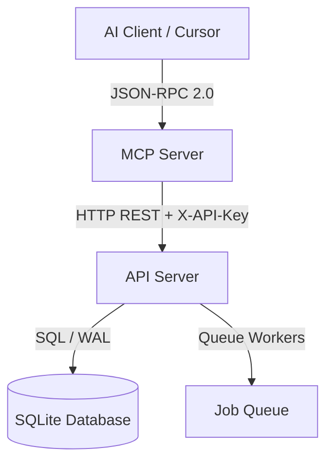
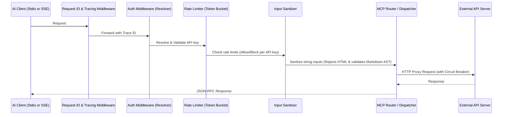
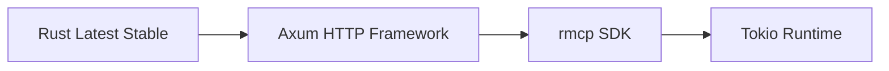
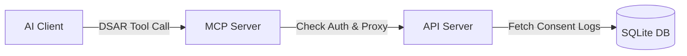

# REMOTE-OX MCP — Enterprise Product Requirements Document (PRD) & Technical Specification

**Version:** 4.0 (Updated Specification)  
**Status:** Approved for Implementation  
**Target Stack:** Rust Latest Stable + rmcp + Axum + Tokio  
**Deployment Target:** Linux VPS (systemd / Docker)  

---

## 1. Document Control & Metadata

### 1.1 Revision History

| Version | Date | Author | Description |
| :--- | :--- | :--- | :--- |
| 1.0 | 2026-05-10 | Arch Team | Initial draft. |
| 2.0 | 2026-05-15 | PM Team | Added compliance and tool requirements. |
| 2.1 | 2026-05-22 | Agent Team | Cleaned up API specs and separated scopes. |
| 3.0 | 2026-05-22 | Lead Architect | Enterprise-grade refactoring, added full system architecture, threat model, CI/CD, testing strategy, and mock details. |
| 3.1 | 2026-05-22 | Architecture Review | Resolved spec inconsistencies, added 4 tools, clarified auth model, added config/env reference and error code mapping. |
| 4.0 | 2026-05-22 | Architecture Review | Added MCP capabilities (resources + prompts), tool annotations, upstream error mapping, CORS config, enhanced sanitization, log redaction, graceful shutdown, deferred Prometheus, updated Rust version. |

### 1.2 Target Audience & Scope
This document specifies the architecture, APIs, security, and deployment models for the **REMOTE-OX MCP Server**. The underlying REST API Server to which the MCP server connects is a separate, external dependency. This document is designed to enable autonomous AI agents or senior engineers to implement the MCP Server with zero ambiguity.

---

## 2. Product & Business Requirements

### 2.1 Context & Core Mission
REMOTE-OX is a decentralized job relay network. The Model Context Protocol (MCP) server acts as a secure, stateless protocol bridge enabling AI Clients (e.g., Cursor, Claude Desktop, customized LLM agents, and terminal IDE plugins) to perform operations on the platform using JSON-RPC 2.0 over MCP transport.

### 2.2 Core KPIs & Targets

| Metric | Target | Verification Method |
| :--- | :--- | :--- |
| **Idle RAM Usage** | < 15MB | `pmap` / Docker Stats |
| **Max Peak RAM** | < 50MB | 1,000 concurrent tool executions |
| **Request Latency Overhead** | < 15ms | Internal middleware telemetry |
| **Uptime** | > 99.9% | Automated ping checks |
| **Security Audit Score** | Zero High/Critical | Cargo Audit & Fuzz testing |

### 2.3 Key User Stories
* **As an AI Developer Agent (e.g., Cursor / Claude),** I want to browse job openings programmatically matching user-described skills so that I can recommend relevant jobs to the user in their IDE chat.
* **As a Candidate User,** I want the AI to submit my application, including cover letters and profile-sourced resumes, securely without exposing raw session credentials to the IDE context.
* **As a Candidate User,** I want the AI to view the details of a job posting I'm interested in, and list all my submitted applications.
* **As a Recruiter User,** I want to ask the AI to post a job listing, search through candidate profiles, or filter candidates using natural language, executing the backend transaction securely.
* **As a Recruiter User,** I want the AI to update the status of a job posting (open/closed/filled/cancelled) as hiring progresses.
* **As any user (via resources),** I want to fetch a specific job, application, or candidate profile by its resource URI so that I can reference and share them across conversations.
* **As a Candidate User (via prompts),** I want to use a guided `search_and_apply_job` workflow that walks me through searching for jobs, viewing details, and submitting an application with a cover letter.
* **As a Recruiter User (via prompts),** I want to use a `post_job_listing` workflow that guides me through setting up a recruiter profile, purchasing job credits, and posting a job listing.

---

## 3. Service Boundaries & Responsibility Matrix

The division of concerns between the **MCP Server** (this project) and the **API Server** (external project) is defined below:



### 3.1 Division of Responsibilities

| Feature / System | In MCP Server (This Project) | In API Server (External Project) |
| :--- | :--- | :--- |
| **Protocol Handling** | Translates JSON-RPC 2.0 to HTTP; manages MCP handshake and transport | None (Standard HTTP REST) |
| **Authentication** | Validates API Key presence: `REMOTE_OX_API_KEY` env var or `~/.config/remoteox/config.json` fallback in Stdio mode; dynamic `X-API-Key` HTTP header validation on incoming SSE `POST` messages. Forwards validated key to upstream | Checks API Key database, manages sessions, signs JWTs |
| **Persistence** | Stateless (No SQLite access) | Owns the SQLite DB and pragmas |
| **Rate Limiting** | Per-API-key token bucket (100 req/min per key) | Upstream IP & client throttling |
| **MCP Capabilities** | Advertises tools, resources, and prompts; manages resource URI templates and prompt templates | None |
| **Business Logic** | None (pure routing/proxying) | Postings logic, wallets, match scoring, consent DB |
| **Data Sanitization** | Strips all HTML tags, validates markdown, NFC-normalizes Unicode | Full DB-level constraint checking & sanitization |
| **GDPR/LGPD Compliance** | Proxies requests; compliance enforcement happens upstream | Owns data rights workflows (erasure, portability, restriction) |

---

## 4. System Architecture & Internal Modularization

### 4.1 Rust Crate Workspace & Code Module Structure
The MCP project will be structured under a clean, single-crate hierarchy:

```text
remote-ox-mcp/
├── Cargo.toml
├── src/
│   ├── main.rs                 # Initialization and server lifecycle orchestration
│   ├── client/
│   │   ├── mod.rs
│   │   └── api_client.rs       # Upstream reqwest wrapper with pool config & circuit breaker
│   ├── config/
│   │   ├── mod.rs
│   │   └── env.rs              # Strongly-typed environment configuration
│   ├── error/
│   │   ├── mod.rs              # Custom error enums (thiserror) & JSON-RPC mapping
│   ├── middleware/
│   │   ├── mod.rs
│   │   ├── rate_limit.rs       # Per-key token bucket rate limiter
│   │   ├── request_id.rs       # Correlation ID generator for tracing
│   │   └── auth.rs             # X-API-Key presence and non-empty validation
│   ├── security/
│   │   ├── mod.rs
│   │   └── sanitization.rs     # HTML stripping and markdown validators
│   ├── tools/
│   │   ├── mod.rs              # Dispatch registry for MCP tools
│   │   ├── candidate.rs        # Tool schemas/handlers for candidates
│   │   ├── recruiter.rs        # Tool schemas/handlers for recruiters
│   │   ├── admin.rs            # Tool schemas/handlers for admins
│   │   └── system.rs           # System schemas (health policy)
│   ├── resources/
│   │   ├── mod.rs              # MCP resource registry and URI routing
│   │   └── templates.rs        # Resource template definitions (job://, application://, candidate://)
│   ├── prompts/
│   │   ├── mod.rs              # MCP prompt template registry
│   │   └── templates.rs        # Prompt template definitions and argument schemas
│   └── validation/
│       ├── mod.rs
│       └── schemas.rs          # Validator rules for JSON-RPC payloads and tool arguments
```

### 4.2 Middleware Execution Pipeline
Every incoming request will traverse the Tower middleware stack in the following sequence:



The middleware stack behaves dynamically based on the active transport layer:
1. **Stdio Transport:** 
   - **Auth Middleware:** Resolves a single static key from the environment variable `REMOTE_OX_API_KEY` or falls back to reading `~/.config/remoteox/config.json`. If missing, the server fails initialization. Every incoming JSON-RPC request is stamped with this resolved key.
   - **Rate Limiting:** Enforced locally against the resolved key.
2. **SSE Transport:**
   - **Auth Middleware:** The SSE stream establishment endpoint (`GET /sse`) is **public** and bypasses authentication. Every subsequent JSON-RPC execution request sent via `POST /message?sessionId=...` must contain the `X-API-Key` HTTP header. The middleware extracts and validates that this header is present and non-empty.
   - **Rate Limiting:** Tracked globally in-memory per `X-API-Key` to prevent a single user from bypassing rate limits across multiple concurrent SSE connections.

The middleware stack applies only to tool execution requests. The `GET /healthz` endpoint bypasses all middleware (no auth, no rate limit, no sanitization).

### 4.3 Circuit Breaker Pattern for Upstream Dependency
To prevent thread starvation and resource leakages during upstream API degradation, the `api_client` will implement a stateful in-memory circuit breaker:

- **Closed State:** Requests are routed normally.
- **Open State:** If the API fails with HTTP `5xx` or request timeouts 5 consecutive times within a rolling window of 10 seconds, the breaker trips to **Open**. All subsequent requests fail immediately with an MCP `InternalError` (-32603) containing the message: *"Upstream service temporarily unavailable. Circuit breaker triggered."*
- **Half-Open State:** After 30 seconds of cooldown, the breaker transitions to **Half-Open**. It allows a single test request through. If it succeeds, it reverts to **Closed**. If it fails, it resets the 30-second **Open** timer.

Circuit breaker parameters are configurable via environment variables (see Section 12).

### 4.4 MCP Capability Registration

During the MCP initialization handshake (`initialize`/`initialized`), the server advertises its capabilities to the client via the `ServerCapabilities` structure:

```json
{
  "capabilities": {
    "tools": {
      "listChanged": false
    },
    "resources": {
      "subscribe": false,
      "listChanged": false
    },
    "prompts": {
      "listChanged": false
    }
  },
  "protocolVersion": "2025-03-26"
}
```

- **Tools:** All 10 tools defined in Section 6.3 are registered with their JSON schemas and annotations.
- **Resources:** Three resource URI templates (`job://{id}`, `application://{id}`, `candidate://{id}`) are exposed. No subscription support.
- **Prompts:** Two prompt templates (`search_and_apply_job`, `post_job_listing`) are registered.
- **Protocol Version:** Targets the latest stable MCP protocol specification. The `rmcp` SDK manages the handshake and transport framing.

---

## 5. Technical Stack Decisions & Rationale



* **Rust (Latest Stable):** Chosen for its memory safety, compile-time validation, and execution speed. Zero runtime garbage collection assists in maintaining memory footprint below the 15MB/50MB limits. Docker image uses `rust:slim-bookworm` to always track the latest stable.
* **Axum (version 0.7+):** Built on hyper, tower, and tokio. It provides compile-time safe routing, path extractors, and natively shares the execution state via Tower middlewares.
* **rmcp (Official Rust MCP SDK):** Offloads manual construction of JSON-RPC protocol messages, handles the MCP initialization handshake (initialize/initialized), and manages SSE transport endpoints. Maintains compatibility with standard MCP clients out-of-the-box.
* **reqwest:** Leverages connection pooling and native HTTP/2 keep-alive.
* **utoipa & utoipa-swagger-ui:** Enables runtime/compile-time extraction of JSON schemas from Rust struct annotations. This lets developers query the API footprint automatically.

---

## 6. Detailed API Contracts & Transport Specification

### 6.1 Transport Layer Specification

**HTTP Health-Check Endpoint**
- **Path & Method**: `GET /healthz`
- **Authentication**: No X-API-Key required (public endpoint).
- **Successful Response**: HTTP 200 with JSON body `{ "status": "ok", "version": "<semver>", "uptime_seconds": <int> }`.
- **Failure Response**: HTTP 5xx with JSON error payload.
- **Bypasses all middleware** (auth, rate limit, sanitization).

The MCP Server must implement two distinct transports, selected via the `--transport` CLI flag:

1. **stdio:** Used for local execution and IDE integration. Communications happen via `stdin` and `stdout` using newline-delimited JSON-RPC 2.0 messages.
   - **Authentication Resolution:** Upon startup in stdio mode, the server first attempts to read `REMOTE_OX_API_KEY` from the environment. If not found, it attempts to parse the user's local config file at `~/.config/remoteox/config.json` (expected shape: `{ "api_key": "..." }`). If neither is resolved, the server logs a critical error and exits with code 1. All JSON-RPC tool and resource requests are proxy-executed using this resolved static key.
2. **SSE (Server-Sent Events):** Used for remote deployments.
   - **Connection Flow:** The client establishes a public Server-Sent Events connection via `GET /sse` (which bypasses X-API-Key middleware). The `rmcp` SDK responds with a stream and emits an `endpoint` event containing a unique postback URI (e.g., `/message?sessionId=xyz`).
   - **Dynamic Authorization:** Every subsequent request sent by the client via HTTP `POST` to `/message?sessionId=xyz` must include the `X-API-Key` HTTP header. If missing or empty, the server rejects the request with HTTP 401. Rate limits are globally monitored and enforced against the `X-API-Key`.
   - **Lifecycle Hardening:** A keep-alive comment (`:ping\n\n`) is emitted over the stream every 15 seconds. Connections are actively monitored, and stale sessions are pruned from memory if no message is received for 60 seconds (post-handshake).

### 6.2 JSON-RPC 2.0 Base Protocol

Every tool call matches the standard JSON-RPC 2.0 structure. The MCP SDK (`rmcp`) manages serialization and deserialization.

**Request Schema:**
```json
{
  "jsonrpc": "2.0",
  "method": "tools/call",
  "params": {
    "name": "search_jobs",
    "arguments": {
      "area": "Developer",
      "region": "Europe",
      "limit": 5
    }
  },
  "id": "req-001"
}
```

**Successful Response Schema:**
```json
{
  "jsonrpc": "2.0",
  "result": {
    "content": [
      {
        "type": "text",
        "text": "{\n  \"total\": 1,\n  \"jobs\": [\n    {\n      \"id\": \"d3b07384-d113-4a1e-8b1b-d1ec39f50e82\",\n      \"title\": \"Senior Rust Engineer\",\n      \"company_name\": \"Acme Corp\"\n    }\n  ]\n}"
      }
    ]
  },
  "id": "req-001"
}
```

**Error Response Codes:**

| Scenario | JSON-RPC Code | Error Message |
| :--- | :--- | :--- |
| Parse Error | -32700 | Standard JSON-RPC parse error |
| Invalid Request / Auth Failure | -32600 | "Missing X-API-Key header" or "Invalid API key" (401/403 from upstream) |
| Method Not Found | -32601 | "Unknown tool: {name}" |
| Invalid Params / Validation Error | -32602 | Validation details in message, or upstream 4xx body forwarded verbatim |
| Internal Error / Rate Limited | -32603 | "Rate limit exceeded. Retry after N seconds" |
| Internal Error / Upstream Rate Limited | -32603 | "Upstream rate limit exceeded. Retry later." (upstream 429) |
| Internal Error / Circuit Breaker Open | -32603 | "Upstream service temporarily unavailable. Circuit breaker triggered." |
| Internal Error / Upstream 5xx | -32603 | "Upstream request failed with status {code}: {truncated body}" |
| Internal Error / Upstream Unreachable or Timeout | -32603 | "Upstream service unreachable or timed out." (Counts toward Circuit Breaker rolling failures) |
| Internal Error / Upstream Schema Drift | -32603 | "Failed to parse upstream response." (Does NOT trigger Circuit Breaker; detailed structural errors logged in secure, redacted logs) |

### 6.3 Tool Mapping Matrix & Contract Definitions

Each tool maps to an upstream route (or local handler). Standard input validations are strictly enforced. The MCP server validates the X-API-Key header is present and non-empty on all tools except `health_check`; the upstream API performs actual key validation.

**Annotations:** `RO` = readOnlyHint (no state change), `D` = destructiveHint (modifies state), `I` = idempotentHint (safe to retry).

| Tool Name | Upstream Route | Role | Annotations | Required Fields | Optional Fields | Constraints |
| :--- | :--- | :--- | :--- | :--- | :--- | :--- |
| `search_jobs` | `GET /jobs/search` | Public | RO, I | `area` (string) | `region`, `type`, `limit`, `offset` | `limit` max: 100, default: 20 |
| `get_job_details` | `GET /jobs/{id}` | Public | RO, I | `job_id` (UUID) | None | Must be valid UUID format |
| `apply_to_job` | `POST /jobs/{id}/apply` | Candidate | D | `job_id` (UUID) | `cover_letter`, `use_profile_resume` | `cover_letter` max size: 20KB |
| `list_my_applications` | `GET /applications` | Candidate | RO, I | None | `limit`, `offset` | `limit` max: 100, default: 20 |
| `search_candidates` | `GET /candidates/search` | Recruiter | RO, I | `skills` (string) | `region`, `limit`, `offset` | `limit` max: 100, default: 20 |
| `create_recruiter` | `POST /recruiters` | Recruiter | D | `company_id` (UUID), `email` (string) | `name`, `role` | Validate email regex pattern |
| `update_job_status` | `PATCH /jobs/{id}/status` | Recruiter | D | `job_id` (UUID), `status` (string) | None | `status` must be one of: `open`, `closed`, `filled`, `cancelled` |
| `purchase_job_credits` | `POST /wallet/purchase/job` | Recruiter | D | `amount` (int) | None | `amount` must be > 0 |
| `get_consent_history` | `GET /consent/history` | Candidate | RO, I | None | `limit`, `offset` | Access-limited to authenticated user by upstream |
| `health_check` | Local (no upstream call) | Public | RO | None | None | Returns MCP server's own health status |

### 6.4 MCP Resources

The server exposes the following MCP resource URI templates, backed by upstream API calls:

| Resource URI Template | Upstream Route | Description |
| :--- | :--- | :--- |
| `job://{id}` | `GET /jobs/{id}` | Individual job listing details. `{id}` is a UUID. |
| `application://{id}` | `GET /applications/{id}` | Individual application details for the authenticated user. `{id}` is a UUID. |
| `candidate://{id}` | `GET /candidates/{id}` | Individual candidate profile. `{id}` is a UUID. |

Resource subscriptions (change notifications) are not supported in v1. Resources are fetched on demand via `resources/read`.

### 6.5 MCP Prompts

The server exposes prompt templates to guide AI clients through multi-step workflows:

**`search_and_apply_job`**

Guides a candidate through: search for jobs by area/skills → view selected job details → apply with optional cover letter.

| Argument | Type | Required | Description |
| :--- | :--- | :--- | :--- |
| `area` | string | Yes | Job area or category to search |
| `skills` | string | No | Specific skills to match |
| `region` | string | No | Geographic region filter |

**`post_job_listing`**

Guides a recruiter through: verify/create recruiter profile → purchase job credits → post a new job listing.

| Argument | Type | Required | Description |
| :--- | :--- | :--- | :--- |
| `company_id` | UUID | Yes | Company identifier for the recruiter |
| `email` | string | Yes | Recruiter email for profile creation |

---

## 7. Security Threat Model & Mitigations

### 7.1 Threat Matrix (STRIDE)

| Threat | STRIDE Category | Mitigation Strategy |
| :--- | :--- | :--- |
| **AI prompt injection causing database corruption** | Tampering | Strict JSON Schema validation. Reject any payload containing script, frame, or SQL keywords. Strip HTML. |
| **Leakage of candidate details in server logs** | Information Disclosure | Implement `LogRedact` middleware. Intercept outgoing metrics and trace writes, stripping strings matching email, UUID, or resume fields. |
| **Denial of Service through rapid connections** | Denial of Service | Per-API-key token bucket rate limit (100 requests/minute). Enforce max payload sizes to 1MB. |
| **Missing or forged API key** | Elevation of Privilege | Validate X-API-Key header is present and non-empty at the middleware layer. Forward to upstream for actual cryptographic verification. |

### 7.2 Strict Input Sanitization Specifications
All incoming string fields are passed through a security-hardened input sanitizer:
* **Strip ALL HTML/XML tags:** Use the standard **`ammonia`** crate (a robust, HTML5-spec-compliant tree-builder HTML sanitizer) to completely strip out *all* HTML and XML tags from every incoming string parameter. Any HTML/XML tags (e.g., `<script>`, `<iframe>`, ``, etc.) and event handlers (`onerror`, `onload`) are completely removed, converting the input into clean plain text prior to transmission to the upstream API.
* **Normalize Unicode:** Convert input strings to Unicode Normalization Form C (NFC) using the `unicode-normalization` crate. This normalization prevents sanitization bypasses that utilize alternate Unicode representations or obfuscated homoglyphs.
* **AST-Based Markdown Link Validation:** For fields that permit Markdown content (e.g., candidate `cover_letter` or recruiter descriptions), the sanitizer must parse the input string using the **`pulldown-cmark`** crate to inspect the Markdown Abstract Syntax Tree (AST):
  - The sanitizer iterates through the resulting event stream. If a `Link` or `Image` event is encountered, the destination URL scheme is inspected.
  - If the URL scheme matches `file://`, contains relative directory traversal patterns (e.g., `..`), or is anything other than the explicitly allowed schemes (`http://`, `https://`, `mailto:`), the request is immediately rejected. The server returns a JSON-RPC `InvalidParams` error (`-32602`) with the message: *"Dangerous or unauthorized link protocol detected in markdown payload."*
* **Reject oversized payloads:** Cap individual string fields at 1MB to prevent CPU/memory resource exhaustion during AST parsing and tree-builder sanitization.

---

## 8. Compliance & Privacy Considerations (LGPD/GDPR)

### 8.1 PII Boundaries
The MCP Server handles PII (Resumes, Cover Letters, Contact Details) purely as a pass-through proxy. All compliance enforcement — data erasure, portability, processing restriction, consent logging — is owned by the upstream API Server. The MCP server does not implement any GDPR/LGPD workflows directly.

### 8.2 Data Rights Mapping



* **Right to Erasure:** The upstream API handles logical and physical deletion. The MCP server does not cache user data.
* **Right to Portability:** The upstream API returns structured JSON dumps. The MCP server proxies the response.
* **Data Restriction:** The upstream API enforces processing restrictions. The MCP server proxies all tool calls without local restriction logic.

---

## 9. Observability & Health Monitoring

### 9.1 Logging Framework
Uses the `tracing` crate stack (`tracing`, `tracing-subscriber`, `tracing-opentelemetry`) for structured, async-aware observability.

- **Development:** Human-readable output with `tracing-subscriber`'s `fmt` layer.
- **Production:** JSON-formatted structured logs with the following fields per event:

```json
{
  "timestamp": "2026-05-22T14:02:10.123Z",
  "level": "INFO",
  "trace_id": "8a3e74b29c914e91",
  "span_id": "b3e94a81",
  "tool_name": "search_jobs",
  "duration_ms": 12.4,
  "status_code": 200
}
```

### 9.2 Log Redaction
A custom `tracing` layer intercepts all log events before output and redacts sensitive fields:
- Email addresses (`user@domain.com` → `user@***`)
- UUIDs in request/response bodies (mask middle segments)
- Resume and cover letter content (replaced with `<redacted PII>`)
- API key header values (replaced with `<redacted>`)

### 9.3 Graceful Shutdown
The server handles `SIGTERM` and `SIGINT` signals via `tokio::signal`:
1. Stop accepting new SSE connections and requests.
2. Drain in-flight requests with a configurable timeout (default 30 seconds).
3. Flush pending log events and tracing exporters.
4. Exit with code 0.

### 9.4 Prometheus Metrics (Deferred)
Prometheus metrics export is deferred to a post-v1 release. The metric namespace (`mcp_*`) is reserved for future implementation.

### 9.5 HTTP Health-Check Endpoint (`GET /healthz`)
- Returns JSON `{ "status":"ok", "version":"<semver>", "uptime_seconds":<int> }` on success (HTTP 200).
- Returns HTTP 5xx with error JSON on failure.
- Bypasses all middleware (auth, rate limit, sanitization).

---

## 10. Testing Strategy

### 10.1 Test Coverage Targets
The project targets **>90% line coverage** for core modules (`src/tools/`, `src/client/`, `src/config/`, `src/error/`, `src/validation/`), verified via `cargo-tarpaulin` or `cargo-llvm-cov` in CI.

```text
[Unit Tests]       --> Mock internal logic, configurations, and validations
[Integration Tests]--> Run actual stdio JSON-RPC sessions covering all 10 tools
[Fuzz Tests]       --> Fuzz string fields using cargo-fuzz to find buffer issues
[Load Tests]       --> Test SSE connection spikes using k6 / locust (post-v1)
```

### 10.2 Mock API Specifications for Local Integration
To support developer isolation, the crate will contain a mock upstream responder. When the environment variable `DEV_MODE_MOCKS=true` is set, the `api_client` routes all HTTP traffic internally to an in-process handler that returns fixed JSON template responses for each tool. The mock is stateless — each tool call returns a hardcoded response matching the expected upstream shape, enabling development without a running API Server.

### 10.3 Integration Test Script Example
A Python-based CLI testing harness is executed on post-build pipelines to check stderr/stdout transport compliance:

```bash
#!/usr/bin/env python3
import json
import subprocess

process = subprocess.Popen(
    ["./target/release/remote-ox-mcp", "--transport", "stdio"],
    stdin=subprocess.PIPE,
    stdout=subprocess.PIPE,
    stderr=subprocess.PIPE,
    text=True
)

request = {
    "jsonrpc": "2.0",
    "method": "tools/call",
    "params": {"name": "health_check", "arguments": {}},
    "id": 1
}

stdout_data, _ = process.communicate(input=json.dumps(request) + "\n")
response = json.loads(stdout_data)
assert "result" in response, "Stdio JSON-RPC contract check failed"
print("Stdio Integration Test Passed")
```

---

## 11. CI/CD & Release Pipeline

The project uses a GitHub Actions workflow with multi-stage Docker builds optimized via `cargo-chef`.

### 11.1 Enterprise Dockerfile (`Dockerfile.production`)

```dockerfile
# Stage 1: Cargo Chef Planner
FROM rust:slim-bookworm AS planner
WORKDIR /app
RUN cargo install cargo-chef
COPY . .
RUN cargo chef prepare --recipe-path recipe.json

# Stage 2: Caching & Dependency Builder
FROM rust:slim-bookworm AS builder
WORKDIR /app
RUN cargo install cargo-chef
COPY --from=planner /app/recipe.json recipe.json
RUN cargo chef cook --release --recipe-path recipe.json

# Stage 3: Project Compilation
COPY . .
RUN cargo build --release --bin remote-ox-mcp

# Stage 4: Clean Runtime Environment
FROM debian:bookworm-slim AS runtime
WORKDIR /app
RUN apt-get update && apt-get install -y ca-certificates libssl3 && rm -rf /var/lib/apt/lists/*
COPY --from=builder /app/target/release/remote-ox-mcp /usr/local/bin/remote-ox-mcp

ENV RUST_LOG=info
EXPOSE 3001
ENTRYPOINT ["/usr/local/bin/remote-ox-mcp"]
```

---

## 12. Configuration & Environment Variables

All configuration is via environment variables, loaded at startup and mapped to a strongly-typed config struct.

| Variable | Default | Description |
| :--- | :--- | :--- |
| `UPSTREAM_BASE_URL` | `http://localhost:3000` | Base URL of the upstream API Server |
| `LISTEN_ADDR` | `0.0.0.0:3001` | MCP server listen address |
| `RUST_LOG` | `info` | Log level (trace, debug, info, warn, error) |
| `RATE_LIMIT_MAX_REQUESTS` | `100` | Maximum requests per API key per window |
| `RATE_LIMIT_WINDOW_SECS` | `60` | Rate limit window in seconds |
| `CIRCUIT_BREAKER_THRESHOLD` | `5` | Consecutive failures before circuit opens |
| `CIRCUIT_BREAKER_WINDOW_SECS` | `10` | Rolling window for failure counting (seconds) |
| `CIRCUIT_BREAKER_COOLDOWN_SECS` | `30` | Time in seconds before transitioning from open to half-open |
| `CORS_ALLOWED_ORIGINS` | `*` | Comma-separated list of allowed CORS origins (SSE transport) |
| `DEV_MODE_MOCKS` | `false` | When `true`, routes upstream calls to in-process mock responder |
| `REMOTE_OX_API_KEY` | None (Optional) | Stdio transport static API key. Fallback: `~/.config/remoteox/config.json`. If neither is found, Stdio initialization fails. |

---

## 13. Developer Experience (DX) & Deployment Configurations

### 13.1 Local Developer Quickstart
```bash
# Clone the repository
git clone https://github.com/remoteox/remoteox-mcp.git
cd remoteox-mcp

# Build the project in debug mode
cargo build

# Run local MCP server over stdio with mock API backend enabled
export DEV_MODE_MOCKS=true
cargo run -- --transport stdio
```

### 13.2 Production systemd Unit Specification (`/etc/systemd/system/remote-ox-mcp.service`)
```ini
[Unit]
Description=Remote OX MCP Server Gateway
After=network.target

[Service]
Type=simple
User=mcpuser
WorkingDirectory=/opt/remote-ox-mcp
EnvironmentFile=/etc/remote-ox-mcp/config.env
ExecStart=/usr/local/bin/remote-ox-mcp --transport sse
Restart=always
RestartSec=5
LimitNOFILE=65535

# Security hardening parameters
ProtectSystem=full
ProtectHome=true
PrivateTmp=true
NoNewPrivileges=true

[Install]
WantedBy=multi-user.target
```

### 13.3 Production Reverse Proxy Configuration (Caddyfile)
```caddy
mcp.remoteox.com {
    # TLS 1.3 Hardening
    tls {
        protocols tls1.3
    }

    # Compress output payloads
    encode gzip zstd

    # Route to Axum SSE listener
    reverse_proxy localhost:3001 {
        header_up Host {host}
        header_up X-Real-IP {remote_host}
        
        # Flush stream updates instantly for SSE
        flush_interval -1
    }

    # Security header injectors
    header {
        X-Content-Type-Options "nosniff"
        X-Frame-Options "DENY"
        Referrer-Policy "no-referrer"
        Content-Security-Policy "default-src 'none'"
        Strict-Transport-Security "max-age=31536000; includeSubDomains; preload"
    }
}
```

---

## 14. Upstream API Contract (Reference)

The upstream API Server contract is defined incrementally during development. Each MCP tool implementation includes the expected upstream request and response shapes as inline documentation. The following endpoints are consumed by the MCP Server:

| Method | Path | Used By |
| :--- | :--- | :--- |
| `GET` | `/jobs/search` | `search_jobs` |
| `GET` | `/jobs/{id}` | `get_job_details` |
| `POST` | `/jobs/{id}/apply` | `apply_to_job` |
| `PATCH` | `/jobs/{id}/status` | `update_job_status` |
| `GET` | `/candidates/search` | `search_candidates` |
| `GET` | `/candidates/{id}` | `candidate://{id}` resource |
| `POST` | `/recruiters` | `create_recruiter` |
| `POST` | `/wallet/purchase/job` | `purchase_job_credits` |
| `GET` | `/consent/history` | `get_consent_history` |
| `GET` | `/applications` | `list_my_applications` |
| `GET` | `/applications/{id}` | `application://{id}` resource |

Request/response schemas for each endpoint are detailed inline in `src/client/api_client.rs` and verified via integration tests.

---
